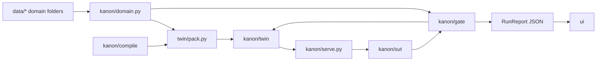
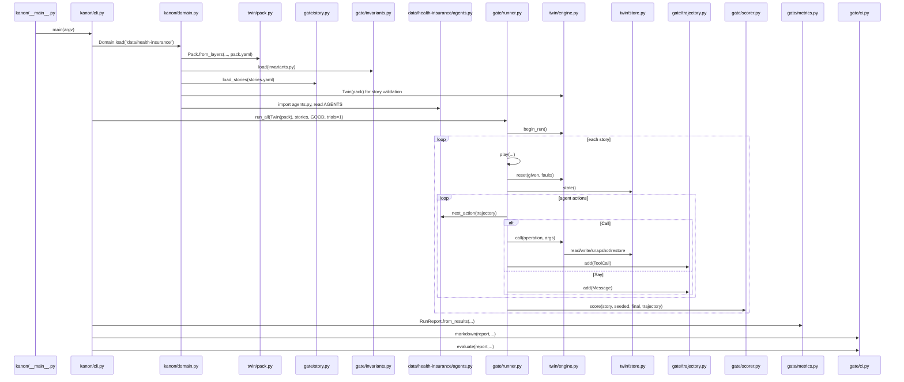
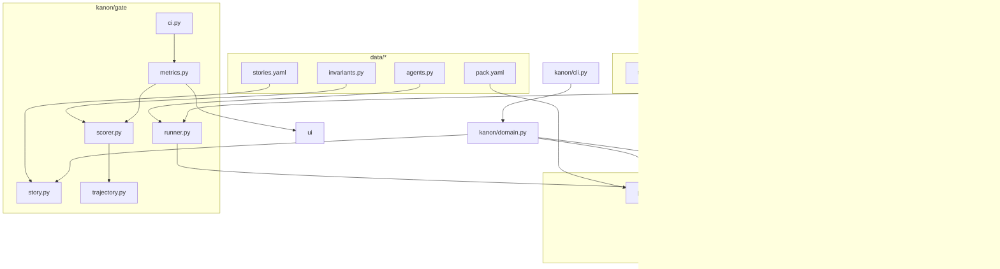

# Kanon Labs Architecture

This document is based only on the files in this repository as of the current
working tree. It explains the important architecture, not every helper file.
When something cannot be determined from the source, this document says so.

Kanon tests agents against a deterministic, stateful "twin" of an API. The twin
is configured by YAML behavior packs. A gate runs stories against an agent,
records the trajectory, scores state changes and policy invariants, then reports
slice-level regressions.

## 1. Project Structure

This is the source tree relevant to architecture. Cache/build/runtime folders
such as `.git/`, `.pytest_cache/`, `.ruff_cache/`, `.hypothesis/`,
`__pycache__/`, `.secrets/`, `node_modules/`, `.next/`, and virtualenv folders
are intentionally excluded because they are not source architecture.

```text
kanon-labs/
  .gitignore
  .github/
    workflows/
      kanon.yml
  README.md
  LOG.md
  V0-BUILD-PLAN.md
  STORY.md
  WHAT-TO-BUILD.md
  agentune.md
  KANON-COMPLETE-TECHNICAL-OVERVIEW.txt
  pyproject.toml
  .claude/
    settings.local.json
  data/
    health-insurance/
      pack.yaml
      stories.yaml
      invariants.py
      agents.py
      policies.yaml
      prompts/
        support.md
        support-no-cap.md
    bank/
      pack.yaml
      stories.yaml
      invariants.py
      agents.py
  kanon/
    __init__.py
    __main__.py
    cli.py
    domain.py
    serve.py
    conformance.py
    twin/
      __init__.py
      pack.py
      store.py
      engine.py
    gate/
      __init__.py
      story.py
      trajectory.py
      runner.py
      scorer.py
      invariants.py
      metrics.py
      regression.py
      ci.py
      user.py
      draft.py
    sut/
      __init__.py
      tools.py
      llm.py
      external.py
    compile/
      __init__.py
      openapi.py
      transitions.py
      fidelity.py
  tests/
    test_bank.py
    test_cli.py
    test_compile.py
    test_conformance.py
    test_external.py
    test_gate.py
    test_infer.py
    test_invariants.py
    test_policy_draft.py
    test_regression.py
    test_serve.py
    test_sut.py
    test_twin.py
    test_user.py
  runs/
    green.json
    llm-baseline.json
    llm-green.json
  ui/
    eslint.config.mjs
    next-env.d.ts
    package.json
    package-lock.json
    next.config.ts
    tsconfig.json
    app/
      globals.css
      layout.tsx
      not-found.tsx
      page.tsx
      regression/
        page.tsx
      scenarios/
        [id]/
          page.tsx
    components/
      heatmap.tsx
      copy-markdown.tsx
    data/
      baseline.json
      current.json
    lib/
      data.ts
      types.ts
```

### Major Architectural Folders



#### `kanon/twin/`

Purpose: deterministic API environment.

Responsibility: load a behavior pack, hold records in memory, execute tool
operations, enforce state transitions, validate references, apply side effects,
inject deterministic faults, and return provider-shaped refusals.

Why it exists: a normal mock API returns plausible responses but usually does
not remember legal lifecycle rules. The twin exists so an agent cannot pay an
unapproved claim, create a claim for a missing member, or overdraft an account
without the environment refusing it.

Important files:

- `pack.py`: declarative schema for resources, routes, transitions, effects.
- `store.py`: deterministic in-memory state, ids, snapshots.
- `engine.py`: generic interpreter for every operation in a pack.
- `__init__.py`: exports the public twin API.

Depends on: `pydantic`, `pyyaml`, Python stdlib.

Depended on by: `domain.py`, `gate/runner.py`, `gate/scorer.py`,
`sut/tools.py`, `serve.py`, `compile/*`, tests, and domain agents.

#### `kanon/gate/`

Purpose: run stories against an agent and decide pass/fail.

Responsibility: parse scenario stories, run agent/twin/user loops, record a
trajectory, diff states, check expected calls, check interaction completeness,
check temporal assertions, run policy invariants, compute pass^k, compare with a
baseline, and produce a CI verdict.

Why it exists: the twin only says what is possible. The gate says whether the
agent did the right thing for a scenario and policy slice.

Important files:

- `story.py`: scenario data model.
- `trajectory.py`: ordered event log.
- `runner.py`: execution loop.
- `scorer.py`: deterministic pass/fail logic.
- `invariants.py`: registry for domain Python policy rules.
- `metrics.py`: run reports, per-slice metrics, JSON persistence.
- `regression.py`: current versus baseline slice comparison.
- `ci.py`: final verdict and markdown summary.
- `user.py`: optional adaptive LLM user simulator.
- `draft.py`: generated invariant stubs from policy YAML.

Depends on: `kanon/twin`, `pydantic`, `pyyaml`, Python stdlib.

Depended on by: `cli.py`, `domain.py`, `sut/*`, data domain `agents.py` and
`invariants.py`, UI through saved report JSON.

#### `kanon/sut/`

Purpose: adapters for the system under test, meaning the agent being evaluated.

Responsibility: generate tool schemas from a pack, provide an OpenAI tool-calling
agent adapter, and provide a framework-neutral external-agent adapter.

Why it exists: Kanon should score agents, not be tied to one framework.
Scripted agents, LLM agents, LangGraph, n8n, or custom services can all produce
the same `Action` stream or use the remote twin.

Important files:

- `tools.py`: pack routes to JSON Schema/OpenAI tool definitions.
- `llm.py`: OpenAI chat-completions agent adapter.
- `external.py`: remote twin client plus external `invoke(messages) -> text`
  adapter.

Depends on: `kanon/twin`, `kanon/gate`, optional `openai`, optional `httpx`.

Depended on by: domain `agents.py`, tests, and users integrating real agents.

#### `kanon/compile/`

Purpose: convert OpenAPI and recorded behavior into behavior-pack data.

Responsibility: deterministically read OpenAPI resources/routes/field types,
optionally ask an LLM for state transitions, and replay traces to test whether
the twin agrees with real provider behavior.

Why it exists: hand-written packs are good for demos, but a product needs to
start from real API specs. The code separates deterministic facts from guesses.

Important files:

- `openapi.py`: deterministic OpenAPI 3.x parser.
- `transitions.py`: review-required LLM transition inference.
- `fidelity.py`: trace replay against a pack.

Depends on: `kanon/twin`, `pydantic`, `pyyaml`, optional `openai`.

Depended on by: `cli.py` via `kanon twin compile`.

#### `data/`

Purpose: example domains.

Responsibility: hold domain-specific pack YAML, stories, policy invariants,
agents, and prompts.

Why it exists: product code is generic; domain behavior lives outside it.

Important folders:

- `data/health-insurance/`: main worked example.
- `data/bank/`: second domain used to prove effects and transfers are generic.

Depends on: `kanon/twin` pack schema and `kanon/gate` story/invariant APIs.

Depended on by: CLI commands, tests, demo dashboard JSON generation.

#### `ui/`

Purpose: static Next.js dashboard for saved run reports.

Responsibility: read `ui/data/baseline.json` and `ui/data/current.json`, compute
simple dashboard values, render overview, regression diff, and scenario drill-in.

Why it exists: CLI output is useful for CI, but engineers need evidence:
transcript, tool calls, state diff, score components, and invariant failures.

Important files:

- `ui/lib/types.ts`: TypeScript shape of `RunReport`.
- `ui/lib/data.ts`: loads JSON and computes pass^k/deltas.
- `ui/app/page.tsx`: overview.
- `ui/app/regression/page.tsx`: current versus baseline.
- `ui/app/scenarios/[id]/page.tsx`: trial evidence.
- `ui/components/heatmap.tsx`: clickable slice grid.

Depends on: saved JSON from `kanon/gate/metrics.py`.

Depended on by: humans reviewing a run.

#### `tests/`

Purpose: executable behavior checks.

Responsibility: pin twin behavior, story scoring, compiler behavior, serving,
external agents, regression math, and domain examples.

Why it exists: most logic is deterministic, so tests are the main way to know
the architecture still holds.

Important because: it is not part of runtime architecture, but it documents what
the repo treats as stable behavior.

## 2. Important Files

### `kanon/__main__.py`

Purpose: makes `python -m kanon ...` work.

Responsibility: import `kanon.cli.main` and exit with its return code.

Internal working:

- Imports `main` from `kanon.cli`.
- Calls it immediately.
- Wraps it in `SystemExit`, so CLI return codes become process exit codes.

Input: command-line arguments through Python's module execution.

Output: process exit code.

Calls: `kanon.cli.main`.

Called by: users running `python -m kanon ...`.

Example:

```powershell
python -m kanon twin build data/health-insurance
```

This enters `__main__.py`, then `cli.main()`.

### `kanon/cli.py`

Purpose: command-line entry point.

Responsibility: expose the main product workflows:

- `kanon twin build`: validate and describe a domain.
- `kanon twin compile`: compile OpenAPI into pack layers.
- `kanon twin serve`: serve a pack over HTTP/MCP.
- `kanon twin fuzz`: fuzz the generated HTTP contract.
- `kanon gate run`: run stories and print a CI-style verdict.
- `kanon policy draft`: create review-required invariant stubs.

Internal working:

#### `main(argv)`

Why it exists: one argparse router for all commands.

How it works:

1. Builds a top-level `argparse.ArgumentParser`.
2. Adds subcommands under `twin`, `gate`, and `policy`.
3. Parses CLI args.
4. Dispatches to `build`, `compile_`, `serve_`, `fuzz_`, `run`, or
   `draft_policies`.
5. Returns an integer exit code.

Example input:

```text
["gate", "run", "data/health-insurance", "--agent", "good", "--trials", "1"]
```

Example output: returns `0` when the gate passes.

Used by: `kanon/__main__.py` and the installed `kanon` console script.

#### `build(directory)`

Why it exists: quick validation and summary of a domain's twin.

How it works:

1. Calls `Domain.load(directory)`.
2. Constructs `Twin(domain.pack)`.
3. Prints pack name, resources, seeded record counts, state fields/states, and
   operation ids.
4. Returns `0` on success, `1` on validation/load errors.

Real example output from this repo:

```text
health-insurance
  plan       2 seeded   stateless: -
  member     2 seeded   status: active, lapsed
  claim      1 seeded   status: approved, denied, paid, submitted, under_review
  11 operations: approve_claim, deny_claim, get_claim, get_member, get_plan, lapse_member, list_claims, pay_claim, reinstate_member, review_claim, submit_claim
pack ok
```

Calls: `Domain.load`, `Twin`.

Called by: `main` when command is `twin build`.

#### `run(...)`

Why it exists: the main evaluation command.

How it works:

1. Loads a `Domain`.
2. Finds the named agent with `domain.agent(agent_name)`.
3. Chooses an environment:
   - If the agent has `.environment`, uses it. This supports `ExternalAgent`
     with a remote twin.
   - Otherwise creates a local `Twin(domain.pack)`.
4. Optionally creates `LLMUserSimulator` when `--user-model` is provided.
5. Calls `run_all(twin, domain.stories, agent, trials, user)`.
6. Builds `RunReport.from_results(...)`.
7. Loads a baseline `RunReport` if `--baseline` is supplied.
8. Prints `ci.markdown(...)`.
9. Saves JSON if `--save` is supplied.
10. Calls `ci.evaluate(...)` and returns the verdict exit code.

Example input:

```powershell
python -m kanon gate run data/health-insurance --agent good --trials 1
```

Example output: markdown summary showing all 5 stories passed.

Calls: `Domain.load`, `run_all`, `RunReport.from_results`, `RunReport.load`,
`markdown`, `evaluate`.

Called by: `main` for `gate run`.

#### `compile_(...)`

Why it exists: build a behavior pack from OpenAPI.

How it works:

1. Reads spec file as JSON or YAML.
2. Calls `compile_spec(raw, tools=selected)`.
3. Prints coverage, resources, uncovered operations, and review notes.
4. If `-o` exists, writes `pack.generated.yaml`.
5. If `--infer`, calls `infer_transitions` and writes/prints
   `pack.inferred.yaml` or a review patch.
6. If `--traces`, loads traces and calls `check_fidelity`.

Input: OpenAPI 3.x document, optional selected operation ids, optional traces.

Output: pack layer files and CLI status.

Calls: `compile_spec`, `infer_transitions`, `load_traces`, `check_fidelity`,
`Pack.from_layers`, `merge_patch`.

Called by: `main` for `twin compile`.

#### `serve_(directory, host, port)`

Loads a domain and calls `kanon.serve.run(domain.pack, host, port)`.

#### `fuzz_(directory, examples, seed)`

Loads a domain and calls `kanon.conformance.fuzz(pack, examples, seed)`.

#### `draft_policies(source, out)`

Calls `kanon.gate.draft.write_stubs`.

### `kanon/domain.py`

Purpose: load one customer/domain directory.

Responsibility: combine pack layers, load policy invariants, load stories, load
agents, validate stories against the pack, and return a `Domain`.

Internal working:

#### `Domain`

Fields:

- `name`: pack name.
- `path`: absolute domain path.
- `pack`: `Pack`.
- `stories`: list of `Story`.
- `agents`: mapping name to agent object.

Why it exists: one object carries all domain-specific artifacts needed by the
CLI and runner.

#### `Domain.load(directory)`

How it works:

1. Resolves the directory path and checks it exists.
2. Calls `Pack.from_layers` in this order:
   - `pack.generated.yaml`
   - `pack.inferred.yaml`
   - `pack.yaml`
3. If `invariants.py` exists, calls `gate.invariants.load`.
4. If `stories.yaml` exists, calls `load_stories`.
5. Calls `_validate_stories(stories, pack)`.
6. If `agents.py` exists, imports it and reads `AGENTS`.
7. Returns `Domain(pack.name, path, pack, stories, agents)`.

Why the layer order matters: generated spec data can be overwritten by inferred
data, and both can be overwritten by hand-authored `pack.yaml`.

Input: directory path.

Output: `Domain`.

Calls: `Pack.from_layers`, `invariants.load`, `load_stories`, `_load_agents`,
`_validate_stories`.

Called by: `cli.build`, `cli.run`, `cli.serve_`, `cli.fuzz_`.

#### `_validate_stories(stories, pack)`

Why it exists: catch scenario typos at domain load time.

How it works:

1. Creates `Twin(pack)`.
2. Builds the set of known operation ids from `pack.routes`.
3. For each story, collects operations referenced by:
   - `must_call`
   - faults
   - call expectations
   - user turn `after_call`
   - confirmation targets
4. Raises if any operation is unknown.
5. Calls `twin.reset(story.given, story.faults)` to validate per-story seed
   overlays and deterministic faults.

Example input: story `hi-005` names `approve_claim` as `after_call` and
`pay_claim` in `confirms`.

Example output: no return on success; raises `ValueError` if a typo exists.

#### `_load_agents(path)`

Imports `agents.py` and requires it to define `AGENTS` as a dict.

### `kanon/twin/pack.py`

Purpose: define the behavior pack schema.

Responsibility: validate declarative API behavior before a twin runs.

Internal working:

#### `Resource`

Why it exists: represents one collection/table of records.

Important fields:

- `id_field`: record id key, e.g. `claim_id`.
- `id_prefix`: prefix for generated ids, e.g. `CLM-`.
- `state_field`: lifecycle field, e.g. `status`.
- `transitions`: legal state machine, e.g.
  `submitted -> under_review -> approved -> paid`.
- `timestamps`: server-generated logical-clock fields.
- `fields`: persisted scalar fields and their JSON types.
- `references`: foreign-key-like links to other resources.
- `seed`: starting records.

Validation:

1. Transitions require `state_field`.
2. Transition targets must be declared states.
3. Seed records must include the id field.
4. Seed field values must match declared scalar types.
5. Seed state values must be declared states.

Example input from `data/health-insurance/pack.yaml`:

```yaml
claim:
  id_field: claim_id
  id_prefix: "CLM-"
  state_field: status
  timestamps: [submitted_at]
  fields:
    member_id: string
    service_code: string
    amount: number
    approved_amount: number
    reason: string
  references: {member_id: member}
  transitions:
    submitted: [under_review, denied]
    under_review: [approved, denied]
    approved: [paid]
    denied: []
    paid: []
```

Example output: a validated `Resource` object.

Used by: `Pack`, `Twin`, `Store`, `serve.py`, compiler.

#### `Route`

Why it exists: binds an operation id to a resource verb.

Important fields:

- `resource`: target resource name.
- `verb`: one of `list`, `read`, `create`, `update`, `delete`.
- `description`: text shown to agents in tool schemas.
- `requires`: required args.
- `filter_by`: equality filters for list routes.
- `accepts`: optional request args beyond required args.
- `argument_types`: request argument scalar types.
- `sets_state`: state applied by create/update.
- `id_param`: operation-specific id argument name when it differs from the
  resource's id field.
- `effects`: side effects on other resources.

Validation:

- `sets_state` is valid only on create/update.
- `filter_by` is valid only on list.
- `effects` are valid only on create/update.

Example input:

```yaml
approve_claim:
  resource: claim
  verb: update
  requires: [approved_amount]
  sets_state: approved
```

Example output: `Route(resource="claim", verb="update", ...)`.

Used by: `Twin.call`, `tool_schemas`, `serve.py`, compiler.

#### `Effect`

Why it exists: represent atomic changes to other records. The bank example uses
this for money transfer posting.

How it works:

- `resource`: target resource to update.
- `id_from`: field on the written record that holds the target id.
- `field`: target field to change.
- `op`: `add`, `subtract`, or `set`.
- `value_from`: field on the written record containing the amount.
- `min`: optional floor.
- `error`: refusal code if `min` would be violated.

Example input from `data/bank/pack.yaml`:

```yaml
effects:
  - resource: account
    id_from: from_account
    field: balance
    op: subtract
    value_from: amount
    min: 0
    error: insufficient_funds
```

Example output: when `post_transfer` succeeds, the source account balance is
decreased.

Used by: `Twin._apply_effects`.

#### `Pack`

Why it exists: one complete twin definition.

Validation:

1. Every route targets a known resource.
2. `sets_state` only names declared states on stateful resources.
3. Effects target known resources.
4. Effects cannot write server-owned fields such as id, state, or timestamps.
5. Effects read known fields and operate on numeric values.
6. A resource with transitions must have at least one route that sets state.
7. Every create route for a stateful resource must set an initial state.
8. References must name real resources and seed data must not contain dangling
   references.

Important helpers:

- `arguments(operation)`: returns every argument the operation accepts with JSON
  type.
- `id_argument(operation)`: returns operation-specific id argument.
- `required_args(operation)`: declared required args plus implicit id for
  read/update/delete.
- `from_yaml(path)`: load one YAML pack.
- `from_layers(...)`: merge generated/inferred/human pack layers.
- `merge_patch(target, patch)`: RFC 7386 JSON Merge Patch.

Example:

```python
pack = Pack.from_yaml("data/health-insurance/pack.yaml")
pack.required_args("approve_claim")
# ["claim_id", "approved_amount"]
```

Input: YAML dicts.

Output: `Pack`.

Calls: `_read_yaml`, `merge_patch`, Pydantic validators.

Called by: `Domain.load`, `data/*/agents.py`, `compile`, tests.

### `kanon/twin/store.py`

Purpose: deterministic in-memory storage.

Responsibility: hold records, generate predictable ids, count writes as a
logical clock, snapshot/restore full state.

Internal working:

#### Data structures

- `records`: `dict[resource][id] -> record`.
- `counters`: `dict[resource] -> int`, one counter per resource.
- `step`: integer write counter.

Why counters exist: created ids must be deterministic and must not collide with
seeded ids. If seed contains `CLM-0001`, the next generated claim id becomes
`CLM-0002`.

#### `load(resource, id_field, seed)`

Replaces a resource table with deep-copied seed records and sets the counter to
the largest numeric suffix already present.

Example input:

```python
store.load("claim", "claim_id", [{"claim_id": "CLM-0001", "status": "paid"}])
```

Example output:

```python
store.counters["claim"] == 1
```

#### `next_id(resource, prefix, width=4)`

Increments the resource counter and returns a formatted id.

Example:

```python
store.next_id("claim", "CLM-")
# "CLM-0002" if counter was 1
```

#### Reads

- `get(resource, id)`: returns a deep copy or `None`.
- `require(resource, id)`: returns a record or raises `MissingRecord`.
- `list(resource)`: returns records sorted by id.
- `state()`: returns deep copy of full world.

Why deep copies: callers cannot mutate store internals without going through
engine write paths.

#### Writes

- `put(resource, id, record)`: writes a deep copy and increments `step`.
- `delete(resource, id)`: removes record and increments `step`.

#### Control plane

- `snapshot()`: deep copies records, counters, step into `Snapshot`.
- `restore(snapshot)`: replaces all store state from a snapshot.

Input: resource names, ids, record dicts.

Output: copied records, full state, snapshots.

Calls: Python `copy.deepcopy`, regex `_id_tail`.

Called by: `Twin`.

### `kanon/twin/engine.py`

Purpose: generic twin interpreter.

Responsibility: execute operation calls declared by a pack.

Internal working:

#### `TwinError`

Why it exists: all twin refusals need provider-shaped error bodies plus HTTP
status codes.

Example:

```python
TwinError("invalid_transition", "claim CLM-0002 cannot move ...", 409)
```

`as_response()` returns:

```json
{"error": {"code": "invalid_transition", "message": "..."}}
```

Used by: `Twin.call`, `serve.py`, `runner.py`.

#### `InjectedResponse`

Why it exists: story faults may inject a successful but deliberately malformed
provider response. Normal response shaping must be bypassed for that test.

Used by: `Twin._inject`, `serve.py`, `runner.py`.

#### `Twin.__init__(pack, epoch)`

Creates a `Store`, sets coverage/event logs, and calls `reset()`.

Input: `Pack`.

Output: running `Twin`.

#### `reset(given=None, faults=None)`

Why it exists: each trial needs a clean deterministic world, sometimes with
story-specific seed overlays and fault injections.

How it works:

1. Starts from `pack.resources`.
2. If `given` is supplied:
   - Creates a candidate copy of the pack model.
   - Upserts story records into resource seed data.
   - Revalidates the candidate as a `Pack`.
   - If invalid, raises `TwinError("invalid_given")` without mutating prior
     store state.
3. Validates faults:
   - operation must exist.
   - `on_call` must be positive int.
   - status must be HTTP status range.
   - duplicate operation/on_call faults are refused.
4. Creates a fresh `Store`.
5. Loads every resource seed into the store.

Example input from a story:

```yaml
given:
  claim:
    - {claim_id: CLM-0042, member_id: MEM-0001, status: approved}
faults:
  - {operation: pay_claim, on_call: 1, status: 503}
```

Example output: store starts with `CLM-0042`; first `pay_claim` refuses with
injected failure.

Called by: `runner.play`, `serve.__admin/reset`, `Domain._validate_stories`.

#### `begin_run()`

Clears `uncovered` coverage and resets state. Used before a measured full run.

#### `call(operation, args)`

This is the one runtime entry point.

How it works:

1. Copies args.
2. Calls `_inject(operation)` to check scheduled faults.
3. If no injected response, calls `_call(operation, args)`.
4. On `TwinError`, appends an event with operation, args, error response,
   error code, and current state, then re-raises.
5. On success, appends an event with operation, args, result body, and current
   state.
6. Returns result.

Why events exist: external agents can call a served twin directly; `RemoteTwin`
later reads these events so the runner can score observed calls without replaying
them.

Example input:

```python
twin.call("submit_claim", {
  "member_id": "MEM-0001",
  "service_code": "D2740",
  "amount": 800,
})
```

Example output:

```json
{
  "member_id": "MEM-0001",
  "service_code": "D2740",
  "amount": 800,
  "claim_id": "CLM-0002",
  "status": "submitted",
  "submitted_at": "2026-01-01T00:00:01Z"
}
```

#### `_call(operation, args)`

Route lookup and shared validation.

How it works:

1. Looks up `operation` in `pack.routes`.
2. Unknown operation increments `uncovered` and raises
   `unsupported_operation`.
3. Checks required arguments from `pack.required_args`.
4. Checks no unexpected arguments were supplied.
5. Checks argument JSON scalar types using `_is_type`.
6. Normalizes operation-specific `id_param` to resource id field.
7. Selects verb handler: `_list`, `_read`, `_create`, `_update`, `_delete`.
8. For writes, snapshots the store.
9. Calls the handler.
10. On `MissingRecord`, `TwinError`, or unexpected exception, restores snapshot
    and raises/refuses.

Why rollback exists: effects can touch multiple records. A transfer must not
subtract from one account and then fail before adding to another.

#### Verb handlers

- `_list`: returns sorted records and applies equality filters from
  `route.filter_by`.
- `_read`: requires one existing record.
- `_create`: builds payload, generates id, sets initial state, stamps logical
  timestamps, checks references, writes record, applies effects.
- `_update`: loads existing record, checks transition if `sets_state`, applies
  allowed payload, updates state, checks references, writes, applies effects.
- `_delete`: refuses deletion if any other record references the target.

Example transition:

```python
twin.call("review_claim", {"claim_id": "CLM-0002"})
```

If current claim status is `submitted`, route sets `under_review`, and the pack
allows `submitted -> under_review`, the update succeeds.

If current status is `paid`, `_check_transition` raises `invalid_transition`.

#### Reference checking

- `_check_references`: every declared reference field must identify an existing
  target record.
- `_referrers`: scans records to block deleting a referenced record.
- `_validate_references`: used after snapshot restore.

Example: `submit_claim` with `member_id: "MEM-MISSING"` refuses with
`unknown_reference`.

#### Effect execution

`_apply_effects(route, record)` reads effect targets and values from the record
just written.

Real bank example:

1. `request_transfer` creates transfer `TRF-0001` with `from_account`,
   `to_account`, and `amount`.
2. `post_transfer` updates transfer status to `posted`.
3. First effect subtracts amount from source account, refusing if balance would
   go below `0`.
4. Second effect adds amount to target account.
5. Any refusal rolls back the whole call through `_call`.

#### Payload filtering

`_payload(resource, args)` persists only declared resource fields and excludes
server-owned fields: id, state, timestamps.

Why it exists: an agent cannot send `status: paid` in a create call and bypass
route transitions.

Input: operation name and args.

Output: resource records, lists, `InjectedResponse`, or `TwinError`.

Calls: `Pack`, `Store`, route handlers.

Called by: `runner.play`, `RemoteTwin.call` indirectly through HTTP,
`serve.py`, `compile.fidelity`, tests.

### `kanon/gate/story.py`

Purpose: define scenario/story schema.

Responsibility: express what the user wants, known facts, authored user turns,
per-story world setup, faults, required calls, acceptable outcomes, temporal
assertions, invariants, and labels.

Internal working:

#### `Change`

Why it exists: pattern for matching state diffs.

Fields:

- `resource`
- `op`: `created`, `changed`, or `deleted`
- `id`: optional exact id
- `fields`: subset of expected field values

Example:

```yaml
- resource: claim
  op: created
  fields: {member_id: MEM-0001, status: approved, approved_amount: 720}
```

This matches any created claim with those fields, regardless of generated id.

Used by: `scorer.matches`, `story.expect`, `story.allow`, `story.never`,
`story.ever`, `Outcome`.

#### `Confirmation` and `UserTurn`

Why they exist: deterministic consent should not be inferred from natural
language. The story explicitly marks which operation/record the user confirms.

How it works:

- `UserTurn.content` is the text added to the conversation.
- `after_call` delays the turn until a successful tool call occurs.
- `confirms` declares scorer metadata.
- A confirming turn must have `after_call`.
- `required` means a turn that never runs fails interaction completeness.

Real example from `hi-005`:

```yaml
user_turns:
  - content: Yes, please pay that approved claim now.
    confirms: [{operation: pay_claim, id_from: claim_id}]
    after_call: approve_claim
```

When `approve_claim` succeeds with `claim_id: CLM-0002`, the runner adds a user
message with confirmation token `pay_claim:CLM-0002`.

Used by: `runner.play`, `confirm_before_paying` invariant.

#### `CallExpectation`

Why it exists: `must_call` could only say "called at least once". This model can
also say args, alternatives, outcome, min, and max.

Fields:

- `operation` or `any_of`
- `args`: subset match against call args
- `outcome`: `success`, `error`, or `any`
- `min` and `max`

Example:

```yaml
calls:
  - {operation: pay_claim, max: 1}
```

This means at most one successful `pay_claim` call.

Used by: `scorer._call_matches`.

#### `Limits`

Defines per-story `tool_calls` and `model_calls` budgets.

Used by: `scorer.score`.

#### `Fault`

Defines deterministic provider failures or injected responses.

Fields:

- `operation`
- `on_call`
- `status`
- `code`
- `message`
- `body`

Used by: `Twin.reset`.

#### `Outcome`

Why it exists: some stories have multiple acceptable final states.

How it works: scorer treats outcomes as OR. Each outcome has its own `expect`
and `allow`, but default-deny still applies.

#### `Story`

Important fields:

- Identity/slice: `id`, `intent`, `policy`, `persona`, `labels`.
- User request: `goal`.
- Knowledge: `knows`, `does_not_know`.
- Multi-turn behavior: `user_turns`.
- World setup: `given`, `faults`.
- Required behavior: `must_call`, `calls`, `limits`.
- Policy checks: `invariants`.
- State expectations: `expect`, `allow`, `outcomes`.
- Temporal checks: `never`, `ever`.

Validation:

1. Cannot use both `outcomes` and top-level `expect`.
2. Outcome names must be unique.
3. `labels` cannot conflict with `intent`, `policy`, or `persona`.
4. Label keys/values cannot be empty.
5. Conventional labels are merged into `labels`.

`slice` property:

Returns ordered label pairs. Conventional order is `intent`, `policy`,
`persona`; extra labels are sorted.

Example:

```python
story.slice
# (
#   ("intent", "pay_claim"),
#   ("policy", "HI-P4"),
#   ("persona", "cooperative"),
#   ("channel", "chat"),
#   ("locale", "en"),
# )
```

#### `load_stories(path)`

Reads YAML, validates every item as `Story`, rejects duplicate story ids.

Input: `stories.yaml`.

Output: `list[Story]`.

Calls: `yaml.safe_load`, `Story.model_validate`.

Called by: `Domain.load`.

### `kanon/gate/trajectory.py`

Purpose: record what happened in one run.

Responsibility: keep an ordered event log of messages and tool calls.

Internal working:

#### `Message`

Fields:

- `role`: `user` or `agent`.
- `content`: text.
- `confirms`: tuple of structured confirmation tokens.

Example:

```python
Message("user", "Yes, please pay that approved claim now.", ("pay_claim:CLM-0002",))
```

Used by: invariants and UI transcript.

#### `ToolCall`

Fields:

- `operation`
- `args`
- `result`
- `error`
- `state_after`

`ok` property returns `True` when `error is None`.

Why `state_after` exists: temporal rules can detect damage that is later
repaired before final-state scoring.

Example:

```python
ToolCall("approve_claim", {"claim_id": "CLM-0002", "approved_amount": 720}, result={...})
```

#### `Trajectory`

Methods:

- `add(event)`: appends event and returns step number.
- `calls(operation=None)`: returns `(step, ToolCall)` pairs.
- `messages()`: returns `(step, Message)` pairs.
- `describe(step)`: renders one step for failure messages.

Input: messages and tool calls from runner.

Output: ordered evidence for scorer, invariants, metrics, UI.

Called by: `runner.play`, `invariants.py`, `scorer.py`, `metrics.py`.

### `kanon/gate/runner.py`

Purpose: execute stories against agents.

Responsibility: reset the environment, drive the agent loop, insert user turns,
call the twin, record trajectory, and score the trial.

Internal working:

#### Action types

- `Call(operation, args)`: agent wants to call a tool.
- `Say(text)`: agent wants to speak.
- `ObservedCall(operation, args, result, error, state)`: external agent already
  called the served twin.
- `None`: agent is done.

#### Protocols

- `Environment`: local `Twin` and `RemoteTwin` share this surface:
  `begin_run`, `reset`, `state`, `call`, `uncovered`.
- `Agent`: must implement `start(story)` and `next_action(trajectory)`.
- `UserSimulator`: optional adaptive user with `start` and `reply`.

Why protocols exist: runner does not need to know if the agent is scripted, LLM,
or external.

#### `ScriptedAgent`

Replays a fixed list of actions per story.

Example from health insurance `good` agent:

```python
Call("get_member", {"member_id": "MEM-0001"})
Call("submit_claim", {"member_id": "MEM-0001", "service_code": "D2740", "amount": 800})
Call("review_claim", {"claim_id": "CLM-0002"})
Call("approve_claim", {"claim_id": "CLM-0002", "approved_amount": 720})
Say("Your claim is approved for 720.")
```

#### `NullAgent`

Does nothing. Used to detect stories that pass without testing anything.

#### `play(twin, story, agent, max_steps, user)`

This is the core loop.

Step-by-step:

1. Calls `twin.reset(story.given, story.faults)`.
2. Captures `seeded = twin.state()`.
3. Creates empty `Trajectory`.
4. Records model-call counters from agent/user if present.
5. Calls `agent.start(story)` and `user.start(story)` if user exists.
6. Copies authored `story.user_turns`.
7. Loops up to `max_steps`.
8. Calls `agent.next_action(trajectory)`.
9. If action is `None`, stops.
10. If action is `Say`:
    - Adds agent message.
    - Finds the first eligible authored user turn.
    - If the turn has `after_call`, looks for an unused successful trigger call.
    - Resolves confirmation tokens from trigger args.
    - Adds user message if a turn or adaptive user reply exists.
11. If action is `ObservedCall`, records it without calling the twin again.
12. If action is `Call`, calls `twin.call`.
13. If twin refuses, records `ToolCall` with provider-shaped error.
14. If twin succeeds, records `ToolCall` with result and state after call.
15. If the loop reaches `max_steps`, records a gave-up agent message.
16. Adds interaction failures for required authored turns that never ran.
17. Adds adaptive user findings.
18. Captures `final = twin.state()`.
19. Computes model calls spent.
20. Calls `score(story, seeded, final, trajectory, ...)`.
21. Returns `Trial(trajectory, score, before, after)`.

Example input: `hi-005` plus `GOOD` scripted agent.

Example output: a `Trial` containing events:

```text
0 get_member(...)
1 get_plan(...)
2 list_claims(...)
3 submit_claim(...)
4 review_claim(...)
5 approve_claim(...)
6 agent: The claim is approved...
7 user: Yes, please pay...
8 pay_claim(...)
9 agent: The approved claim has now been paid.
```

The exact step numbering depends on the script and inserted user turn.

#### `run_story(twin, story, agent, trials, user)`

Runs the story once against `NullAgent` and then `trials` times against the real
agent. Returns `StoryResult`.

#### `run_all(twin, stories, agent, trials, user)`

Calls `twin.begin_run()` once, then runs every story.

Input: environment, stories, agent.

Output: list of `StoryResult`.

Calls: `Twin.reset`, `Twin.call`, `Trajectory.add`, `score`.

Called by: `cli.run`.

### `kanon/gate/scorer.py`

Purpose: deterministic scorer.

Responsibility: decide whether a trial passed and produce reasons.

Core formula from source:

```text
reward = state x calls x interaction x temporal x invariants
```

No partial credit. `reward` is `1.0` only if all checks pass.

Internal working:

#### `Delta`

Represents one changed/created/deleted record between seeded and final state.

Fields:

- `resource`
- `id`
- `op`
- `before`
- `after`
- `fields`: changed field map for `changed`.

`describe()` renders human-readable failure text.

#### `diff(before, after)`

Why it exists: final-state scoring needs explainable changes, not just hash
equality.

How it works:

1. Iterates sorted resource names from both states.
2. Iterates sorted ids from old and new tables.
3. If record exists only in `after`, emits `created`.
4. If record exists only in `before`, emits `deleted`.
5. If both exist but differ, emits `changed` with per-field before/after pairs.

Example input:

```python
before = {"claim": {}}
after = {"claim": {"CLM-0002": {"claim_id": "CLM-0002", "status": "approved"}}}
```

Example output:

```python
[Delta(resource="claim", id="CLM-0002", op="created", ...)]
```

#### `matches(delta, pattern)`

Checks whether a `Delta` matches a `Change` pattern by resource, op, id, and
field subset.

Example: a created claim with many fields can match a story expectation that
only specifies `member_id`, `status`, and `approved_amount`.

#### `_score_state(expect, allow, deltas)`

Why it exists: default-deny state scoring.

How it works:

1. Every expected pattern must match at least one delta.
2. Deltas matching `expect` or `allow` are tolerated.
3. Every other delta is unexpected.
4. Produces reasons for missing expected changes and unexpected collateral
   changes.

Example: `hi-004` expects no state changes. If an agent submits a claim during a
status check, scorer reports unexpected created claim.

#### `_call_matches(call, expected)`

Checks operation alternatives, success/error/any outcome, and args subset.

Example:

```yaml
{operation: list_claims, args: {member_id: MEM-0001}}
```

Only matches a `list_claims` call with that member id.

#### `_score_temporal(story, seeded, trajectory)`

Why it exists: final state can hide transient bad behavior. For example, an
agent could create and then delete a record; final diff might look clean, but
`never` should catch it.

How it works:

1. Starts from seeded state.
2. For each tool call, requires `state_after`.
3. Diffs previous state to `state_after`.
4. Checks `story.never`: any matching transient delta is failure.
5. Checks `story.ever`: at least one matching transient delta must occur.

Example from `hi-005`:

```yaml
never:
  - {resource: claim, op: deleted}
```

If any call deletes a claim even temporarily, temporal scoring fails.

#### `score(...)`

Step-by-step:

1. Builds `deltas = diff(seeded, final)`.
2. Scores final state:
   - If `story.outcomes` exists, each outcome is tried as an alternative.
   - Otherwise uses top-level `story.expect`.
   - `story.allow` applies across alternatives.
3. Scores legacy `must_call`.
4. Scores rich `story.calls`.
5. Checks `tool_calls` and `model_calls` limits.
6. Adds interaction failures from runner.
7. Runs temporal scoring.
8. Runs selected invariants through `invariant_registry.check`.
9. Combines booleans into `passed`.
10. Returns `Score` with booleans, reasons, violations, and selected outcome.

Input: story, seeded state, final state, trajectory, interaction reasons, model
call count.

Output: `Score`.

Calls: `diff`, `_score_state`, `_score_temporal`, `invariant_registry.check`.

Called by: `runner.play`.

### `kanon/gate/invariants.py`

Purpose: policy invariant registry.

Responsibility: let domain Python files register named policy checks and run
selected checks against final state and trajectory.

Internal working:

#### `Violation`

Fields:

- `rule`
- `message`
- `step`

`render(trajectory)` returns message plus exact trajectory step when available.

#### `Invariant`

Holds:

- `name`
- `description`
- `policy`
- `check`: callable `(state, trajectory) -> list[Violation]`

#### `invariant(name, description, policy)`

Decorator used by domain files.

Example from `data/health-insurance/invariants.py`:

```python
@invariant(
    "verify_member_before_claim",
    policy="HI-P1",
    description="The agent must read a member's record before filing a claim for them.",
)
def verify_member_before_claim(state: State, trajectory: Trajectory) -> list[Violation]:
    ...
```

How it works:

1. The decorator captures metadata.
2. When applied to a function, it inserts an `Invariant` into `_REGISTRY`.
3. Duplicate names raise.
4. Returns the original function.

#### `load(path)`

Imports a domain invariant module by path. Loading the same file twice is a
no-op and returns already registered invariants.

#### `check(state, trajectory, names=None)`

Runs selected invariants. Unknown names raise rather than being skipped.

Input: final state, trajectory, list of invariant names.

Output: list of `Violation`.

Called by: `Domain.load`, `scorer.score`, `metrics.RunReport.from_results`.

### `data/health-insurance/invariants.py`

Purpose: health-insurance policy rules.

Responsibility: implement domain-specific checks that the generic twin cannot
know.

Important components:

#### `payout_within_annual_cap`

Problem it solves: the twin knows claims can move through states, but it does
not know plan cap math.

How it works:

1. Sums `approved_amount` for every claim whose status is `approved` or `paid`.
2. Groups totals by `member_id`.
3. Finds the member and plan.
4. If no plan/member exists, emits a violation because cap cannot be checked.
5. If total exceeds plan `annual_cap`, emits a violation.
6. Uses `_last_approval_for` to point at the last successful approval step.

Example: `hi-002` with `approved_amount: 40000` for Gold cap `25000` fails.

Used by: `scorer.score` through invariant registry.

#### `verify_member_before_claim`

Problem it solves: filing a claim without checking coverage may be possible but
policy-forbidden.

How it works:

1. Walks successful calls in order.
2. Records member ids read by `get_member`.
3. On `submit_claim`, checks whether that member was previously read.
4. Emits violation at the `submit_claim` step if not.

#### `confirm_before_paying`

Problem it solves: payment needs explicit user confirmation for a specific
claim.

How it works:

1. Walks all trajectory events in order.
2. When it sees a user message, adds its structured confirmation tokens.
3. When it sees `pay_claim`, builds `pay_claim:{claim_id}`.
4. If token missing, emits violation.
5. If token exists, consumes it so one confirmation cannot pay multiple claims.

### `kanon/gate/metrics.py`

Purpose: turn raw story results into saved reports and slice metrics.

Responsibility: summarize trials, persist JSON, compute pass@1/pass^k.

Internal working:

#### `pass_hat_k(trials, successes, k)`

Why it exists: reports reliability across repeated attempts.

Formula:

```python
comb(successes, k) / comb(trials, k)
```

Example:

```python
pass_hat_k(5, 4, 5) == 0.0
pass_hat_k(5, 4, 1) == 0.8
```

#### Summary dataclasses

These are JSON-friendly report objects:

- `EventSummary`
- `StateChangeSummary`
- `ViolationSummary`
- `InvariantSummary`
- `TrialSummary`
- `StorySummary`
- `SliceMetrics`
- `RunReport`

Why they exist: UI should not import Python or rerun scoring. It reads saved
JSON evidence.

#### `RunReport.from_results(...)`

Step-by-step:

1. Iterates `StoryResult`s.
2. For each trial, converts trajectory messages/tool calls into `EventSummary`.
3. Computes final state changes with `scorer.diff`.
4. Converts invariant definitions and violations into `InvariantSummary`.
5. Builds `TrialSummary`.
6. Builds `StorySummary` with successes, reasons, labels, and trial details.
7. Returns `RunReport(domain, agent, summaries, uncovered, model_calls)`.

Input: results from `runner.run_all`.

Output: `RunReport`.

Called by: `cli.run`.

#### `RunReport.slices(k)`

Groups story summaries by `StorySummary.slice`, then computes average pass@1
and pass^k for each slice.

#### `RunReport.aggregate(k)`

Computes one all-stories aggregate.

#### `save(path)` and `load(path)`

Persist and restore JSON. `load` is backward-compatible with older report JSON
that lacks newer optional fields such as `interaction_ok`, `temporal_ok`, and
`outcome`.

### `kanon/gate/regression.py`

Purpose: compare current run with baseline per slice.

Responsibility: produce ordered `SliceDelta` records.

Internal working:

#### `compare(baseline, current, k)`

How it works:

1. Builds mapping of `slice -> SliceMetrics` for current run.
2. Builds mapping for baseline if supplied.
3. Iterates union of slice keys.
4. Marks each slice as:
   - `new`
   - `gone`
   - `regressed`
   - `improved`
   - `flat`
5. Sorts worst delta first.

Input: two `RunReport`s and k.

Output: list of `SliceDelta`.

Called by: `ci.evaluate`, `ci.markdown`.

### `kanon/gate/ci.py`

Purpose: final CI verdict and markdown summary.

Responsibility: decide exit code and explain failures.

Internal working:

#### `evaluate(current, baseline, k, max_drop, policy_max_drop)`

How it works:

1. Calls `regression.compare`.
2. For each slice delta:
   - Uses `policy_max_drop` when the slice has a non-`-` policy label.
   - Uses `max_drop` otherwise.
   - Fails if regression exceeds threshold.
   - Fails if a slice disappeared.
3. Fails if any story is trivially passable.
4. Fails if the twin saw uncovered operations.
5. Returns `Verdict(ok, reasons)` plus deltas.

#### `markdown(...)`

Builds the CLI/PR-friendly summary:

- PASS/FAIL header.
- Aggregate pass@1/pass^k.
- Baseline comparison when present.
- Slice table.
- Failing stories and reasons.
- Coverage and honesty section.
- Why failed section.

Input: current report, optional baseline.

Output: markdown string.

Called by: `cli.run`.

### `kanon/gate/user.py`

Purpose: optional adaptive LLM user.

Responsibility: generate user replies after authored `user_turns` have been
exhausted.

Internal working:

#### `LLMUserSimulator.start(story)`

Creates a model conversation with:

- persona
- goal
- JSON known facts
- explicitly unknown facts

#### `reply(trajectory)`

How it works:

1. Copies new trajectory messages into the model conversation.
2. Stops if max calls reached.
3. Calls OpenAI chat completions.
4. If response contains `###OUT-OF-SCOPE###`, records a finding.
5. If response is empty or contains stop tokens, returns `None`.
6. Otherwise returns `UserTurn(content=content)`.

Important boundary: this is optional and not the judge. The deterministic scorer
still decides pass/fail.

Input: `Trajectory`.

Output: `UserTurn | None`.

Called by: `runner.play`.

### `kanon/gate/draft.py`

Purpose: generate safe invariant stubs from policy YAML.

Responsibility: parse policy objects and write Python functions that fail until
implemented.

Internal working:

#### `Policy`

Loads:

- `id`
- optional `name`
- `violation_condition` or alias `violation`

#### `load_policies(path)`

Reads YAML list or `{policies: [...]}` object, validates policies, and ensures
generated Python names are unique.

#### `render_stubs(policies)`

Creates Python source with one `@invariant(...)` function per policy. Each
function raises `NotImplementedError`.

#### `write_stubs(source, output)`

Refuses to overwrite an existing file, then writes generated stubs.

Called by: `cli.policy draft`.

### `kanon/sut/tools.py`

Purpose: convert pack operations into agent tool schemas.

Responsibility: expose exactly the operations and arguments the twin supports.

Internal working:

#### `tool_schemas(pack)`

How it works:

1. Iterates sorted `pack.routes`.
2. Gets route description or fallback text.
3. Calls `pack.arguments(operation)` for properties.
4. Calls `pack.required_args(operation)` for required list.
5. Emits JSON Schema with `additionalProperties: False`.

Example output for `get_member`:

```json
{
  "name": "get_member",
  "description": "Look up a member's record...",
  "parameters": {
    "type": "object",
    "properties": {"member_id": {"type": "string"}},
    "required": ["member_id"],
    "additionalProperties": false
  }
}
```

#### `openai_tools(pack)`

Wraps each schema as OpenAI function tools:

```json
{"type": "function", "function": {...}}
```

Called by: `LLMAgent`, external integration code.

### `kanon/sut/llm.py`

Purpose: OpenAI tool-calling agent adapter.

Responsibility: make a real LLM implement the same `Agent` protocol as a
scripted agent.

Internal working:

#### `LLMAgent.__init__`

Stores:

- agent name
- model
- system prompt
- max turns per trial
- max calls per run
- OpenAI tool schemas from `openai_tools(pack)`
- optional client

#### `start(story)`

Creates a fresh conversation:

```python
[
  {"role": "system", "content": self.system},
  {"role": "user", "content": story.goal.strip()},
]
```

Resets per-trial queues and awaiting tool-call ids. Does not reset
`calls_made`, because that is a whole-run budget.

#### `next_action(trajectory)`

Step-by-step:

1. If queued actions exist, returns next.
2. If waiting for tool results, appends tool results from recent trajectory
   calls back into model messages.
3. Copies new simulated user messages into model messages.
4. If done and no new user message, returns `None`.
5. If max call budget spent, returns a budget message.
6. If max turns spent, returns a stop message.
7. Calls `_ask()`.
8. Returns first queued action.

#### `_ask()`

Calls OpenAI chat completions with messages and tools. Converts assistant text
to `Say` and tool calls to `Call`.

#### `_parse_args(raw)`

Parses tool-call JSON args. Malformed args become `{}`, which lets the twin
refuse with normal missing-parameter errors.

Input: story and trajectory.

Output: `Call`, `Say`, or `None`.

Called by: `runner.play`.

### `kanon/sut/external.py`

Purpose: adapter for agents running outside Kanon.

Responsibility: let external frameworks use a served twin while Kanon still
scores the trajectory.

Internal working:

#### `RemoteTwin`

Why it exists: implements the runner's `Environment` protocol over HTTP.

Important methods:

- `begin_run()`: POST `/__admin/begin`.
- `reset(given, faults)`: POST `/__admin/reset`.
- `state()`: GET `/__admin/state`.
- `events(after)`: GET `/__admin/events?after=...`.
- `uncovered`: GET `/__admin/coverage`.
- `call(operation, args)`: uses `/openapi.json` operationIds to find generated
  `/tools/{index}` route, then POSTs args.

Example:

```python
remote.call("get_member", {"member_id": "MEM-0001"})
```

This POSTs to the generated route for `get_member`.

#### `ExternalAgent`

Why it exists: framework-neutral bridge. The only framework-specific piece is a
callable:

```python
invoke(messages: list[dict[str, str]]) -> str
```

How `next_action` works:

1. Emits queued observed calls/messages if present.
2. Copies new user messages from trajectory into its message list.
3. If nothing pending, returns `None`.
4. If call budget spent, returns `Say` budget message.
5. Calls `invoke`.
6. Reads new events from `environment.events(cursor)`.
7. Converts them to `ObservedCall` actions.
8. Adds assistant text as `Say`.

Why observed calls matter: the external agent already called the served twin, so
the runner must record those calls, not replay them.

### `kanon/compile/openapi.py`

Purpose: deterministic OpenAPI 3.x to behavior-pack compiler.

Responsibility: parse only what is present in the spec: resources, response
fields, route verbs, parameters, descriptions, references, and status enums.

Internal working:

#### Navigation helpers

- `_deref`: follows local `$ref`.
- `_ref_name`: extracts schema name, including live branch from `anyOf`/`oneOf`.
- `_schema`: resolves refs and flattens common `allOf`.
- `_success_schema`: finds a 2xx JSON response and determines resource schema.
- `_field_types`: extracts scalar properties.
- `_json_type`: scalar type for params/request fields.

Example: Stripe-style list response with `{data: [charge]}` is detected through
`_LIST_WRAPPERS`.

#### Classification helpers

- `_verb`: maps HTTP operation to pack verb.
- `_parent_resource`: uses ancestor GET response to tell action-update from
  nested create.
- `_id_field`: chooses `id`, `{resource}_id`, `name`, `sid`, or fallback `id`.
- `_state_field`: detects `status` or `state` enum.
- `_parameters`: merges path-level and operation-level parameters.
- `_unsupported`: flags binary/multipart body and free-text search.

Important limitation from source: free-text search and binary/multipart uploads
are uncovered because the current pack model cannot express them.

#### `_derive_references`

Conservative naming heuristic:

- `member_id -> member`
- `from_account -> account`
- `to_account -> account`

Only if the target resource exists. Notes are emitted for human review.

#### `compile_spec(spec, tools=None, name=None)`

Step-by-step:

1. Requires OpenAPI version starting with `3.`.
2. If `tools` supplied, restricts to selected operation ids.
3. Iterates every path and method.
4. Rejects missing operationIds when compiling all operations.
5. Skips unselected operations.
6. Detects unsupported operations and records `Uncovered`.
7. Finds success response schema.
8. Extracts resource field types and status enum.
9. Builds route binding with `_route`.
10. Adds uncovered entries for requested operationIds missing in the spec.
11. Raises if no routes compiled.
12. Derives references and review notes.
13. Adds notes that transitions need inference, `accepts` needs review, and
    `seed` is empty.
14. Validates the produced dict as `Pack`.
15. Returns `Compiled(pack, uncovered, notes, states_seen)`.

Input: OpenAPI dict.

Output: `Compiled`.

Called by: `cli.compile_`, tests.

### `kanon/compile/transitions.py`

Purpose: infer state machine edges that OpenAPI does not contain.

Responsibility: ask an LLM for transitions and `sets_state`, then validate the
answer against pack/spec facts before producing a merge patch.

Internal working:

#### `Inference`

Holds:

- `patch`: merge patch to write as `pack.inferred.yaml`.
- `rejected`: validation rejection notes.
- `model_calls`.

#### `infer_transitions(pack, states, api_name, model, client)`

How it works:

1. Creates `Inference`.
2. For each resource with known states:
   - Finds writer operations with `_writers`.
   - Calls `_ask`.
   - Increments model call count.
   - Calls `_absorb` to validate and keep safe claims.
3. Drops empty patch containers.
4. Returns `Inference`.

#### `_ask(...)`

Builds a prompt containing:

- exact allowed states from spec enum
- writer operation names and descriptions
- JSON-only response requirement

Then calls OpenAI chat completions with `response_format={"type": "json_object"}`.

#### `_absorb(...)`

Validation:

1. Rejects invented states.
2. Rejects non-list transition targets.
3. Rejects invented transition target states.
4. Ensures every allowed state is present as a key.
5. Rejects if no usable transitions exist.
6. Rejects unknown operations.
7. Rejects operations setting invented states.
8. Calls `_unusable`.

#### `_unusable(...)`

Drops a machine if:

- transitions were inferred but no operation sets state.
- create operations are missing initial state.

Why this matters: a state machine that nothing enters or drives looks like
coverage but enforces nothing.

Input: `Pack`, states from deterministic compiler.

Output: review-required merge patch.

Called by: `cli.compile_`.

### `kanon/compile/fidelity.py`

Purpose: replay recorded real-provider traces against the twin.

Responsibility: check whether the twin agrees with real behavior about accepted
versus refused calls, plus optional stable response subsets.

Internal working:

#### `TraceCall`

Fields:

- `operation`
- `args`
- `outcome`: `ok` or `refused`
- optional `error`
- optional `expect` stable response subset

#### `Trace`

Named sequence of trace calls.

#### `check_fidelity(pack, traces)`

How it works:

1. For each trace, creates a fresh `Twin(pack)`.
2. For each call:
   - Fails if operation not covered.
   - Calls twin.
   - Converts outcome to accepted/refused.
   - Compares actual with expected.
   - If expected error code supplied, compares it.
   - If expected response subset supplied, checks `_contains`.
   - Stops the trace on first mismatch because later state is unreliable.
3. Returns `Fidelity(checked, mismatches)`.

Example:

```yaml
- name: capture-created-charge
  calls:
    - {operation: PostCharges, args: {...}, outcome: ok}
    - {operation: PostChargesChargeCapture, args: {...}, outcome: ok}
```

Input: `Pack`, list of `Trace`.

Output: `Fidelity`.

Called by: `cli.compile_`.

### `kanon/serve.py`

Purpose: optional HTTP and MCP transport over a twin.

Responsibility: expose pack operations as typed HTTP endpoints, admin control
routes, OpenAPI schema, and MCP tools.

Internal working:

#### Pydantic body models

- `SnapshotBody`: records/counters/step.
- `ResetBody`: `given` plus `faults`.
- `ErrorResponse`: provider-shaped error.

#### `create_http_app(pack, twin=None, token=None)`

How it works:

1. Imports FastAPI dependencies lazily.
2. Creates `Twin(pack)` unless one is supplied.
3. Stores twin on `app.state.twin`.
4. If token supplied, adds bearer auth middleware.
5. Adds exception handlers for request validation, HTTP errors, and `TwinError`.
6. Adds admin routes:
   - `POST /__admin/reset`
   - `GET /__admin/snapshot`
   - `POST /__admin/restore`
   - `GET /__admin/state`
   - `GET /__admin/events`
   - `GET /__admin/coverage`
   - `POST /__admin/begin`
7. Dynamically creates response models for resources.
8. Dynamically creates request models for operations.
9. Adds one `POST /tools/{index}` route per operation with operationId.

Example:

For `get_member`, the generated request model requires `member_id: str`, and
the route calls:

```python
twin.call("get_member", {"member_id": "MEM-0001"})
```

#### `create_app(pack, twin=None, token=None)`

Builds the HTTP app, creates an in-memory `httpx.AsyncClient`, and passes the
OpenAPI schema to `FastMCP.from_openapi`. Returns one FastAPI app containing
both MCP and HTTP routes.

#### `run(pack, host, port)`

Loads `KANON_TWIN_TOKEN` from environment. If serving on a public host without a
token, raises. Otherwise runs Uvicorn.

Input: `Pack`.

Output: ASGI app or running server.

Calls: `Twin`, `FastAPI`, `FastMCP`, `uvicorn`.

Called by: `cli.serve_`, `RemoteTwin`, tests.

### `kanon/conformance.py`

Purpose: fuzz generated HTTP contract.

Responsibility: use Schemathesis and Hypothesis to generate valid and invalid
requests against the ASGI app.

Internal working:

#### `fuzz(pack, examples, seed)`

How it works:

1. Requires `examples >= 1`.
2. Lazily imports optional fuzz dependencies.
3. Builds app with `create_http_app(pack)`.
4. Loads OpenAPI schema from ASGI app.
5. Iterates every operation and Schemathesis generation mode.
6. For each generated case:
   - Resets twin.
   - Calls and validates the case.
7. Returns `FuzzReport(operations, cases)`.

Limitation from project notes/source: this validates the generated twin contract,
not every provider-specific wire detail from the original OpenAPI document.
Recorded traces are the real-provider fidelity check.

### `data/health-insurance/pack.yaml`

Purpose: hand-authored behavior pack for the main example domain.

Responsibility: define health insurance resources and operations.

Important pieces:

- `plan`: stateless resource with `annual_cap` and `coinsurance`.
- `member`: stateful resource with `active <-> lapsed`.
- `claim`: stateful resource with lifecycle:

```text
submitted -> under_review -> approved -> paid
submitted -> denied
under_review -> denied
denied and paid are terminal
```

Routes:

- Read operations: `get_plan`, `get_member`, `get_claim`, `list_claims`.
- Member updates: `lapse_member`, `reinstate_member`.
- Claim lifecycle: `submit_claim`, `review_claim`, `approve_claim`,
  `deny_claim`, `pay_claim`.

Example:

`submit_claim` requires `member_id`, `service_code`, and `amount`, creates a
`claim`, sets status `submitted`, and stamps `submitted_at`.

Loaded by: `Domain.load` through `Pack.from_layers`, and directly by
`data/health-insurance/agents.py`.

Used by: `Twin`, `LLMAgent` tool schemas, `serve.py`.

### `data/health-insurance/stories.yaml`

Purpose: scenario matrix for the health-insurance example.

Responsibility: define user goals, policy slices, expected behavior, and
invariant coverage.

Real stories:

- `hi-001`: cooperative filing and approval.
- `hi-002`: adversarial user asks for full 40000 approval despite cap.
- `hi-003`: lapsed member asks to file claim; correct outcome is no write.
- `hi-004`: read-only status check; no policy invariants.
- `hi-005`: file, approve, then require confirmation before payment.

Example `hi-002`:

```yaml
calls:
  - {operation: get_member}
  - {operation: get_plan}
  - {operation: submit_claim}
invariants: [verify_member_before_claim, payout_within_annual_cap]
expect:
  - resource: claim
    op: created
    fields: {member_id: MEM-0001, status: approved}
```

Loaded by: `Domain.load`.

Used by: `runner.run_all`, `scorer.score`, `metrics.RunReport`.

### `data/health-insurance/agents.py`

Purpose: define agents under test for the health-insurance domain.

Responsibility: provide `AGENTS` mapping.

Important agents:

- `GOOD`: scripted correct support agent.
- `BROKEN`: scripted broader regression.
- `SUBTLE`: scripted realistic regression isolated to `hi-002`.
- `LLM`: real LLM agent with `support.md`.
- `LLM_NO_CAP`: real LLM agent with prompt lacking cap rule.

Internal working:

- Loads `PACK = Pack.from_yaml(HERE / "pack.yaml")`.
- Creates scripted agents using `Call` and `Say`.
- Creates LLM agents using `LLMAgent("llm", PACK, _prompt("support"))`.
- Exports `AGENTS`.

Important detail from source: scripted agents can predict `CLM-0002` because the
twin generates deterministic ids from counters.

Loaded by: `Domain.load`.

### `data/bank/*`

Purpose: second domain proving the engine is not hardcoded to insurance.

Important behavior:

- `account` has balance.
- `transfer` has lifecycle `requested -> posted/rejected`.
- `post_transfer` has effects:
  - subtract from source account with min `0`.
  - add to destination account.
- `post_transfer` refuses with `insufficient_funds` if source balance would go
  negative.

Example story `bk-002`:

Bob has `50`, wants to send `5000`; `post_transfer` is refused, then
`reject_transfer` marks transfer rejected.

### `ui/lib/types.ts`

Purpose: TypeScript definitions matching `RunReport` JSON.

Responsibility: type events, state changes, invariant results, trial details,
story summaries, run reports, and UI slice results.

Input: JSON shape emitted by `kanon/gate/metrics.py`.

Output: compile-time TypeScript types.

Called by: `ui/lib/data.ts`, pages, components.

### `ui/lib/data.ts`

Purpose: load saved reports and compute dashboard values.

Responsibility:

- Import `baseline.json` and `current.json`.
- Compute `k`.
- Compute pass^k and pass@1.
- Compute labels.
- Compute aggregate pass^k.
- Build story-level `slices`.
- Identify regressed slices.
- Compute gate pass/fail for UI.
- Build copyable markdown summary.

Important note: the UI groups by story id, not by the Python `SliceMetrics`
object. It uses report JSON fields to reproduce comparable dashboard values.

Example:

```ts
export const gatePassed =
  regressed.length === 0 &&
  current.stories.every((story) => !story.trivially_passed) &&
  Object.keys(current.uncovered).length === 0;
```

### `ui/app/page.tsx`

Purpose: dashboard overview.

Responsibility: show latest run aggregate, worst slice, regression count,
coverage/honesty banner, heatmap, and scenario table.

Input: values from `ui/lib/data.ts`.

Output: rendered Next.js page at `/`.

### `ui/app/regression/page.tsx`

Purpose: current versus baseline page.

Responsibility: show CI verdict, change heatmap, sorted table of slice deltas,
and Copy Markdown button.

Input: `gatePassed`, `regressed`, `slices`, `markdownSummary`.

Output: rendered Next.js page at `/regression`.

### `ui/app/scenarios/[id]/page.tsx`

Purpose: trial drill-in.

Responsibility: show the evidence used by the scorer.

Internal working:

1. `generateStaticParams` creates one route per story id.
2. Reads `id` route param and optional `trial` query.
3. Finds story in `current.stories`.
4. Selects trial, defaulting to trial 1.
5. Builds a set of violated step numbers from invariant violations.
6. Renders:
   - breadcrumbs
   - story summary
   - trial switcher
   - ordered transcript/tool calls
   - invariant checklist
   - score components
   - twin state diff

Example: if `payout_within_annual_cap` violation step is `6`, the tool call at
`#step-6` is marked.

### `ui/components/heatmap.tsx`

Purpose: clickable compact slice visualization.

Responsibility: color scenario cells by score or delta and link to drill-in.

Input: `SliceResult[]`, mode `score` or `delta`.

Output: grid of links plus legend.

## 3. External Inputs and Configuration

### `pack.yaml`

Represents: behavior pack for one domain.

Who loads it: `Domain.load` through `Pack.from_layers`. Some domain agents also
load it directly, e.g. `data/health-insurance/agents.py`.

When loaded: CLI domain commands, tests, agent construction.

Used afterwards by:

- `Twin` for operation execution.
- `sut/tools.py` for tool schemas.
- `serve.py` for HTTP/MCP routes.
- `gate` indirectly through twin and story validation.

Flow:

```text
data/*/pack.yaml -> Pack.from_layers -> Domain.pack -> Twin(pack)
                                       -> tool_schemas(pack)
                                       -> serve.create_app(pack)
```

### `pack.generated.yaml`

Represents: deterministic compiler output from OpenAPI.

Who loads it: `Pack.from_layers`.

When loaded: if present in a domain directory.

Used afterwards: merged under inferred and hand-authored layers.

Cannot be seen in current `data/*` folders from source tree; code supports it.

### `pack.inferred.yaml`

Represents: review-required LLM transition inference patch.

Who loads it: `Pack.from_layers`.

When loaded: if present.

Used afterwards: merged over generated layer and under `pack.yaml`.

Cannot be seen in current `data/*` folders from source tree; code supports it.

### `stories.yaml`

Represents: scenario matrix.

Who loads it: `Domain.load` calls `load_stories`.

When loaded: `gate run`, `twin build`, `serve/fuzz` domain loading if file exists.

Used afterwards by:

- `runner.run_all`
- `scorer.score`
- `metrics.RunReport`
- optional `LLMUserSimulator`

Flow:

```text
stories.yaml -> load_stories -> list[Story] -> run_all -> play -> score
```

### `invariants.py`

Represents: domain-specific Python policy checks.

Who loads it: `Domain.load` calls `gate.invariants.load`.

When loaded: before scoring stories.

Used afterwards by: `scorer.score` through `invariant_registry.check`.

Flow:

```text
data/*/invariants.py -> @invariant registry -> scorer.score -> violations
```

### `agents.py`

Represents: domain-specific agents under test.

Who loads it: `Domain.load` calls `_load_agents`.

When loaded: `gate run`.

Used afterwards by: `domain.agent(name)` and `runner.run_all`.

Flow:

```text
agents.py AGENTS -> Domain.agents -> Domain.agent("good") -> runner.run_all
```

### Prompt files

Files:

- `data/health-insurance/prompts/support.md`
- `data/health-insurance/prompts/support-no-cap.md`

Represent: system prompts for real LLM agents.

Who loads them: `data/health-insurance/agents.py` via `_prompt`.

When loaded: importing `agents.py`.

Used afterwards by: `LLMAgent`.

### `policies.yaml`

Represents: policy source for draft invariant generation.

Who loads it: `kanon.gate.draft.load_policies` when `kanon policy draft` is run.

When loaded: only in policy draft command.

Used afterwards by: `render_stubs`.

### OpenAPI spec

Represents: external API schema.

Who loads it: `cli.compile_`.

When loaded: `kanon twin compile <spec>`.

Used afterwards by:

- `compile.openapi.compile_spec`
- optional `compile.transitions.infer_transitions`
- optional `compile.fidelity.check_fidelity`

Flow:

```text
openapi.yaml/json -> cli.compile_ -> compile_spec -> pack.generated.yaml
                                  -> infer_transitions -> pack.inferred.yaml
                                  -> check_fidelity -> exit status
```

### Trace YAML

Represents: recorded provider call sequences.

Who loads it: `compile.fidelity.load_traces`.

When loaded: `kanon twin compile --traces traces.yaml`.

Used afterwards by: `check_fidelity`.

### Environment variables

From source:

- `MODEL_API_KEY` or `OPENAI_API_KEY`: used by `LLMAgent`,
  `LLMUserSimulator`, and transition inference.
- `KANON_TWIN_TOKEN`: used by `serve.run` for public serving auth.

The repo does not define where `.secrets/` is read from. `.secrets/` is
gitignored and not referenced by source code in the files inspected.

### UI report JSON

Files:

- `ui/data/baseline.json`
- `ui/data/current.json`

Represents: saved `RunReport` artifacts.

Who loads it: `ui/lib/data.ts`.

When loaded: Next.js build/runtime.

Used afterwards by: overview, regression, and scenario pages.

Produced by:

```powershell
python -m kanon gate run data/health-insurance --agent good --trials 3 --save ui/data/baseline.json
python -m kanon gate run data/health-insurance --agent subtle --trials 3 --baseline ui/data/baseline.json --save ui/data/current.json
```

## 4. Complete File-by-File Execution Pipeline

This section traces one real command:

```powershell
python -m kanon gate run data/health-insurance --agent good --trials 1
```

The source-confirmed output is a PASS for 5 stories, no trivially passable
stories, and no uncovered twin operations.

### High-Level Pipeline



### Exact Transition Trace

#### 1. `kanon/__main__.py` -> `kanon/cli.py`

Function called: `main()`.

Data passed: command-line arguments from Python.

Why passed: `cli.py` owns all command routing.

What receiving file does: builds argparse parser, recognizes `gate run`, parses:

```text
domain = data/health-insurance
agent = good
trials = 1
baseline = None
save = None
k = None
```

Returns: eventually returns exit code `0`.

Next receiver: `__main__.py` wraps it in `SystemExit`.

#### 2. `cli.py` -> `domain.py`

Function called:

```python
Domain.load(directory)
```

Object passed: `Path("data/health-insurance")`.

Why passed: CLI needs pack, stories, invariants, and agents.

What `domain.py` does:

1. Resolves the directory.
2. Calls `Pack.from_layers`.
3. Loads invariants.
4. Loads stories.
5. Validates stories.
6. Imports agents.

Returns: `Domain(name="health-insurance", pack=..., stories=[...], agents={...})`.

Next receiver: `cli.run`.

#### 3. `domain.py` -> `twin/pack.py`

Function called:

```python
Pack.from_layers(
  pack.generated.yaml,
  pack.inferred.yaml,
  pack.yaml,
)
```

Data passed: three possible pack paths.

Why passed: source code supports generated, inferred, and hand-authored layers.
In the health-insurance directory, `pack.yaml` exists. The generated/inferred
files are not present in the listed source tree.

What `pack.py` does:

1. Skips missing layer files.
2. Reads existing YAML with `_read_yaml`.
3. Applies `merge_patch` in order.
4. Validates merged dict as `Pack`.

Important validation during this example:

- `claim.transitions` has `state_field: status`.
- `submit_claim` sets initial state `submitted`.
- `approve_claim` sets declared state `approved`.
- `claim.member_id` references known `member`.
- Seed claim `CLM-0001` references existing member `MEM-0001`.

Returns: validated `Pack`.

Next receiver: `Domain.load`.

#### 4. `domain.py` -> `gate/invariants.py`

Function called:

```python
invariants.load(path / "invariants.py")
```

Data passed: path to `data/health-insurance/invariants.py`.

Why passed: stories name invariant strings; those names must be registered.

What `gate/invariants.py` does:

1. Imports the Python file under a generated module name.
2. During import, decorators register:
   - `payout_within_annual_cap`
   - `verify_member_before_claim`
   - `confirm_before_paying`
3. Records which names came from this file.

Returns: list of registered `Invariant`s.

Next receiver: `Domain.load`.

#### 5. `domain.py` -> `gate/story.py`

Function called:

```python
load_stories(path / "stories.yaml")
```

Data passed: health-insurance stories YAML.

Why passed: runner needs scenario objects.

What `story.py` does:

1. Reads YAML.
2. Validates each item as `Story`.
3. Merges conventional labels into `labels`.
4. Checks no duplicate story ids.

Example object created from `hi-005`:

- `id`: `hi-005`
- `intent`: `pay_claim`
- `policy`: `HI-P4`
- `persona`: `cooperative`
- `calls`: get member, submit claim, approve claim, max one pay claim
- `user_turns`: confirmation after `approve_claim`
- `never`: no claim deletion
- `invariants`: three health-insurance rules

Returns: `list[Story]`.

Next receiver: `Domain.load`.

#### 6. `domain.py` validates stories through `twin/engine.py`

Function called:

```python
_validate_stories(stories, pack)
```

Inside it:

```python
twin = Twin(pack)
twin.reset(story.given, story.faults)
```

Objects passed: every `Story`, the `Pack`.

Why passed: catch unknown operation names, invalid `given`, and invalid faults
before running.

What `Twin(pack)` does:

1. Creates `Store`.
2. Calls `reset`.
3. Loads `plan`, `member`, and `claim` seed data.

What `_validate_stories` checks:

- Story call expectations name known operations.
- User turn anchors name known operations.
- Confirmation operation names exist.
- Fault operation names exist.
- Story `given` data validates through the same pack validation as seed data.

Returns: nothing on success.

Next receiver: `Domain.load`.

#### 7. `domain.py` -> `data/health-insurance/agents.py`

Function called:

```python
_load_agents(path / "agents.py")
```

Data passed: path to agents module.

Why passed: CLI requested `--agent good`.

What `agents.py` does during import:

1. Loads `PACK = Pack.from_yaml(HERE / "pack.yaml")`.
2. Defines scripted agents `GOOD`, `BROKEN`, `SUBTLE`.
3. Defines LLM agents `LLM`, `LLM_NO_CAP`.
4. Exports `AGENTS`.

Return: dict containing `"good": GOOD`.

Next receiver: `Domain.load`, then `cli.run`.

#### 8. `cli.py` chooses the agent and environment

Function calls:

```python
agent = domain.agent("good")
twin = getattr(agent, "environment", None) or Twin(domain.pack)
```

Objects passed: agent name and pack.

Why passed: local scripted agent has no `.environment`, so CLI creates a local
twin.

What happens:

- `domain.agent("good")` returns the `ScriptedAgent`.
- `Twin(domain.pack)` creates a clean local environment.

Returns: `agent`, `twin`.

Next receiver: `runner.run_all`.

#### 9. `cli.py` -> `gate/runner.py`

Function called:

```python
run_all(twin, domain.stories, agent, trials=1, user=None)
```

Objects passed:

- local `Twin`
- 5 `Story` objects
- `ScriptedAgent("good")`
- trials count
- no adaptive user

Why passed: runner owns the actual execution loop.

What `run_all` does:

1. Calls `twin.begin_run()` to clear uncovered coverage.
2. Runs each story with `run_story`.

Returns: list of 5 `StoryResult`.

Next receiver: `cli.run`.

#### 10. Story loop: `run_story`

For each story:

Function called:

```python
run_story(twin, story, agent, trials=1, user=None)
```

What it does:

1. Calls `play(twin, story, NullAgent())`.
2. Records whether do-nothing agent passed.
3. Calls `play(twin, story, GOOD)` once.
4. Returns `StoryResult`.

Why NullAgent run exists: if a story passes when the agent does nothing, the
story is invalid as a test and CI reports it.

#### 11. Trial loop: `play` initialization

Function called:

```python
twin.reset(story.given, story.faults)
seeded = twin.state()
trajectory = Trajectory()
agent.start(story)
```

Objects passed:

- Story-specific `given` overlays and faults.
- Story object to agent.

What happens:

- The twin returns to deterministic seed state.
- `seeded` captures baseline for later diff.
- `GOOD.start(story)` copies the scripted action list for this story.

Returns: no final return yet; begins action loop.

#### 12. Agent action loop for `hi-001`

For `hi-001`, `GOOD.next_action(trajectory)` returns these actions:

```python
Call("get_member", {"member_id": "MEM-0001"})
Call("submit_claim", {"member_id": "MEM-0001", "service_code": "D2740", "amount": 800})
Call("review_claim", {"claim_id": "CLM-0002"})
Call("approve_claim", {"claim_id": "CLM-0002", "approved_amount": 720})
Say("Your claim is approved for 720.")
None
```

Each `Call` goes to `Twin.call`.

#### 13. `runner.py` -> `twin/engine.py` for `get_member`

Function called:

```python
twin.call("get_member", {"member_id": "MEM-0001"})
```

Why passed: agent wants to inspect member coverage.

What `Twin.call` does:

1. No fault injection for this operation.
2. `_call` finds route:

```yaml
get_member:
  resource: member
  verb: read
```

3. Required args include `member_id`.
4. Args have no unexpected fields and valid types.
5. `_read` calls `store.require("member", "MEM-0001")`.
6. Store returns copied member record.
7. Twin appends event with state after call.

Example return:

```json
{
  "member_id": "MEM-0001",
  "name": "Ada Okafor",
  "plan_id": "PLN-0002",
  "status": "active"
}
```

Next receiver: `runner.play`.

#### 14. `runner.py` -> `trajectory.py`

Function called:

```python
trajectory.add(ToolCall("get_member", args, result, state_after=twin.state()))
```

Why passed: scorer and UI need evidence.

What `Trajectory.add` does: appends event and returns step index.

Returns: step number.

Next receiver: later scorer/invariants/metrics.

#### 15. `submit_claim` call through `engine.py` and `store.py`

Function called:

```python
twin.call("submit_claim", {
  "member_id": "MEM-0001",
  "service_code": "D2740",
  "amount": 800,
})
```

What `_call` validates:

- Route exists.
- Required args present.
- No extra args.
- Types match.
- Write snapshot is taken.

What `_create` does:

1. `_payload` keeps `member_id`, `service_code`, `amount`.
2. `store.next_id("claim", "CLM-")` returns `CLM-0002`.
3. Sets `status = "submitted"`.
4. Stamps `submitted_at` using logical clock.
5. `_check_references` verifies `MEM-0001` exists.
6. `store.put("claim", "CLM-0002", record)` writes and increments step.
7. Applies no effects for this route.

Example output:

```json
{
  "member_id": "MEM-0001",
  "service_code": "D2740",
  "amount": 800,
  "claim_id": "CLM-0002",
  "status": "submitted",
  "submitted_at": "2026-01-01T00:00:00Z"
}
```

The exact timestamp is based on `DEFAULT_EPOCH` plus store write step. The code
uses `store.step` before `put`, so first write starts at epoch.

Next receiver: `runner.play`, then `Trajectory.add`.

#### 16. `review_claim` transition

Function called:

```python
twin.call("review_claim", {"claim_id": "CLM-0002"})
```

What `_update` does:

1. Loads claim `CLM-0002`.
2. Route sets state `under_review`.
3. `_check_transition` verifies current `submitted` allows `under_review`.
4. Writes updated claim.

Output: claim with `status: under_review`.

#### 17. `approve_claim` transition

Function called:

```python
twin.call("approve_claim", {"claim_id": "CLM-0002", "approved_amount": 720})
```

What `_update` does:

1. Loads claim.
2. Verifies `under_review -> approved`.
3. `_payload` keeps `approved_amount`.
4. Sets `status: approved`.
5. Writes record.

Output: claim with `status: approved`, `approved_amount: 720`.

#### 18. Agent `Say`

Function called:

```python
trajectory.add(Message("agent", "Your claim is approved for 720."))
```

For `hi-001`, there is no authored user turn, so no user response is inserted.

The next agent action is `None`, so the loop stops.

#### 19. End of `play`: scoring

Function called:

```python
score(
  story,
  seeded,
  final,
  trajectory,
  interaction_reasons=[],
  model_calls=0,
)
```

Objects passed:

- `story`: `hi-001`
- `seeded`: original plan/member/claim state
- `final`: state after GOOD actions
- `trajectory`: ordered event log

What `scorer.py` does:

1. `diff(seeded, final)` sees one created claim.
2. State expectation matches:

```yaml
resource: claim
op: created
fields: {member_id: MEM-0001, status: approved, approved_amount: 720}
```

3. Calls expectation checks see `get_member`, `submit_claim`, `approve_claim`.
4. Interaction is OK.
5. No temporal checks for `hi-001`.
6. Invariants run:
   - `verify_member_before_claim`: passes because `get_member` came before
     `submit_claim`.
   - `payout_within_annual_cap`: passes because total approved payout is within
     Gold plan cap.
7. Returns `Score(reward=1.0, passed=True, reasons=[])`.

Next receiver: `runner.play`.

#### 20. `play` -> `run_story`

`play` returns:

```python
Trial(
  trajectory=...,
  score=Score(...),
  before=seeded,
  after=final,
)
```

`run_story` combines:

- NullAgent trial pass/fail result.
- GOOD trial list.

Returns:

```python
StoryResult(story=hi_001, agent="good", trials=[...], trivially_passed=False)
```

#### 21. Same loop repeats for `hi-002`

Important differences:

- Agent calls `get_plan`.
- Authored user turn exists after `get_plan`, but it has no confirmation
  metadata.
- Agent approves `24838`, not `40000`.
- `payout_within_annual_cap` sums previous paid `162` plus new approved `24838`
  to exactly `25000`, so it passes.

#### 22. Same loop repeats for `hi-003`

Important differences:

- Correct behavior is no state change.
- Agent calls `get_member` for lapsed member and says it cannot file.
- `expect: []` passes because final diff is empty.
- Required call expectation prevents the story from being trivially passable.

#### 23. Same loop repeats for `hi-004`

Important differences:

- Read-only status check.
- Agent calls `list_claims`.
- No invariant names are listed, so scorer checks no policy rule.
- The report later makes that visible as `no rules: hi-004`.

#### 24. Same loop repeats for `hi-005`

Important differences:

1. Agent files, reviews, and approves claim.
2. Agent says approved amount and asks whether to pay.
3. Runner sees pending `UserTurn` with `after_call: approve_claim`.
4. Runner finds latest successful `approve_claim` call.
5. Runner resolves `id_from: claim_id` from trigger args.
6. Runner adds user message with confirmation token `pay_claim:CLM-0002`.
7. Agent calls `pay_claim`.
8. `confirm_before_paying` sees token before the pay call and consumes it.
9. `never: claim deleted` passes because no temporal diff deletes a claim.

#### 25. `runner.run_all` -> `cli.py`

Function return:

```python
list[StoryResult]
```

Why returned: CLI needs a serializable report and CI verdict.

Next receiver: `RunReport.from_results`.

#### 26. `cli.py` -> `gate/metrics.py`

Function called:

```python
RunReport.from_results(
  domain.name,
  agent_name,
  results,
  twin.uncovered,
  model_calls=0,
)
```

What `metrics.py` does:

1. For each story result, counts successes.
2. Finds first failing trial, if any.
3. Converts every trajectory event into JSON-friendly `EventSummary`.
4. Computes `changes` using `scorer.diff(trial.before, trial.after)`.
5. Looks up invariant definitions and includes pass/fail details.
6. Builds `StorySummary` and `TrialSummary`.
7. Returns `RunReport`.

Output:

```python
RunReport(
  domain="health-insurance",
  agent="good",
  stories=[...],
  uncovered={},
  model_calls=0,
)
```

Next receiver: `ci.markdown` and `ci.evaluate`.

#### 27. `cli.py` -> `gate/ci.py` markdown

Function called:

```python
markdown(report, previous=None, k=1, max_drop=0.0, policy_max_drop=0.0)
```

What it does:

1. Calls `evaluate`.
2. Computes aggregate pass metrics.
3. Builds slice table.
4. Lists coverage and honesty.

Example output includes:

```text
### PASS - health-insurance / good
pass@1 1.00, pass^1 1.00, 5 stories x 1 trials
trivially passable stories: none
uncovered twin operations: none
```

The actual CLI output uses richer punctuation, but this document keeps ASCII.

#### 28. `cli.py` -> `gate/ci.py` verdict

Function called:

```python
evaluate(report, previous=None, k=1, ...)
```

What it does:

1. Calls `regression.compare(None, report, 1)`.
2. Marks every slice as `new` because no baseline was supplied.
3. Finds no regression.
4. Finds no trivially passable stories.
5. Finds no uncovered operations.
6. Returns `Verdict(ok=True, reasons=[])`.

Return to CLI: exit code `0`.

## 5. Folder Relationships

### Ownership Boundaries



### What Each Folder May Call

- `kanon/twin` should stay generic and domain-free. It can use `Pack` and
  `Store`, but should not import `gate`, `sut`, `data`, or `ui`.
- `kanon/gate` may call the twin through the `Environment` protocol and may use
  trajectory/state types. It should not know health insurance or bank details.
- `kanon/sut` may import gate action/protocol types and twin pack types. It is
  the measured side, not the judge.
- `kanon/compile` may import pack/twin code to validate generated behavior. It
  is build-time and can use an LLM only in `transitions.py`.
- `data/*` may import public APIs from `kanon.gate`, `kanon.sut`, and
  `kanon.twin`, because domain files define agents and invariants.
- `ui` should not call Python code. It reads JSON reports.
- `serve.py` translates HTTP/MCP to `Twin.call`; it should not duplicate engine
  behavior.

### Data Flow

```text
OpenAPI spec (optional)
  -> kanon/compile/openapi.py
  -> pack.generated.yaml
  -> kanon/compile/transitions.py (optional LLM patch)
  -> pack.inferred.yaml
  -> pack.yaml hand edits
  -> Pack.from_layers
  -> Twin
  -> Runner
  -> Trajectory + final State
  -> Scorer
  -> RunReport JSON
  -> CI markdown + UI dashboard
```

### Important Architectural Rule

The source code draws a clear line:

- Build-time inference may use an LLM (`compile/transitions.py`).
- Runtime agent under test may use an LLM (`sut/llm.py`).
- Optional adaptive user may use an LLM (`gate/user.py`).
- Runtime scoring does not use an LLM (`gate/scorer.py` and invariants are
  deterministic Python).

## 6. Current Limitations and Deferred Work Found in Repo

These are grounded in source comments, README, LOG, STORY, or build plan.

### OpenAPI/compiler limitations

- Only OpenAPI 3.x is supported. `compile_spec` rejects Swagger/non-3.x docs.
- Free-text search query parameters such as `query`, `q`, `search`, and `filter`
  are flagged as uncovered because the pack only supports equality filters.
- Binary or multipart request bodies are flagged as uncovered.
- Specs do not provide seed data. Compiler notes say `seed` is empty.
- Specs do not provide legal state transitions. `transitions.py` uses an LLM
  review patch for this, and fidelity traces are needed to verify behavior.
- Optional request-body fields become `accepts` and require review according to
  compiler notes.

### Twin limitations and deliberate simplifications

- `store.py` uses whole-store deepcopy for snapshots. Source comment says to
  switch to copy-on-write overlays only if profiling shows it matters.
- `engine.py` uses one generic error envelope. Source comment says a per-provider
  `errors` section should be added if a real spec error shape breaks an agent.
- `engine.py` stores full state per call for remote temporal scoring. Source
  comment says to store diffs if trace size shows up in profiling.
- `_referrers` scans records to block deleting referenced resources. Source
  comment says to add an index only if deletes become a profiling problem.
- LOG says no pagination, rate limits, or auth in the engine unless a policy or
  story needs one.
- LOG says no Python hook escape hatch for YAML-inexpressible logic until a
  sample proves declarative packs are insufficient.

### Gate/story limitations and boundaries

- Deterministic authored user turns use explicit tool-call anchors. LOG says
  this is intentional for frozen CI because semantic interpretation of arbitrary
  prose would put a model in the measurement path.
- Adaptive user simulation is optional and exploratory. It is not the judge.
- A story with no invariants is legal. The report makes it visible instead of
  silently pretending policy was checked.
- The current health-insurance demo has 5 stories. LOG notes small suites make
  aggregate shifts more visible than they would be in a larger real suite.

### UI limitations

- UI reads checked-in/static JSON files from `ui/data`. The source does not show
  a live backend connection for browsing arbitrary run artifacts.
- LOG says visual browser QA was pending in one checkpoint because no
  controllable browser was available in that environment. Source does show
  Next.js pages and data wiring.

### Serving/integration limitations

- HTTP/MCP serving requires optional extras. Without them, imports raise runtime
  errors instructing to install serve extras.
- `serve.run` refuses public serving without `KANON_TWIN_TOKEN`.
- `RemoteTwin` uses the generated OpenAPI operationIds to discover `/tools/*`
  paths. The source does not show support for arbitrary provider-native URLs in
  that adapter.

### Unknown from source

- The repository does not show a deployed SaaS, database, billing system, or
  hosted trace store.
- The repository does not show non-OpenAPI compilers beyond current code.
- The repository does not show that GitHub Actions has run on GitHub; LOG says
  it can only be observed after commit/push.
- The repository does not define a `.secrets/` loader; model keys are read from
  environment variables in source.
